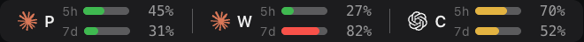
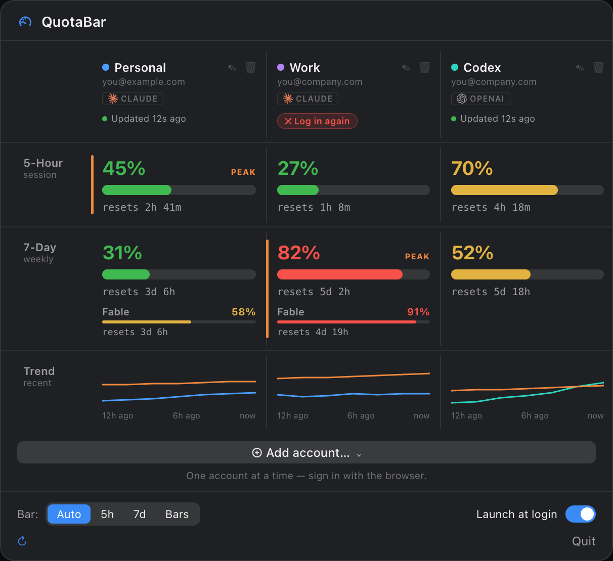

# ClaudeUsageBar

A lightweight macOS menu bar app that shows your Claude API usage limits at a glance. Zero dependencies — just Apple frameworks.

[](https://github.com/sam-pop/ClaudeUsageBar/actions/workflows/ci.yml)


## What It Does

ClaudeUsageBar sits in your menu bar showing a usage window and its reset countdown. Click to see full details — both usage windows, color-coded progress bars, live countdowns, and a 24-hour usage trend sparkline.

It signs in on its own — a browser OAuth login (authorization code + PKCE) straight to Anthropic or OpenAI — and calls the usage API directly. Claude Code doesn't need to be installed, or logged in, or running.

**Multiple accounts.** Track more than one Claude account at once (e.g. personal + work). Each is signed in independently through its own browser login and refreshes independently, so nothing about one account affects another. With one account the menu bar is unchanged; with two or more it shows a compact per-account summary like `P 45% · W 82%`, with a full breakdown per account in the popover. See [Multiple accounts](#multiple-accounts).

**Key features:**

- Sign in with just a browser — no Claude Code CLI, install, or login required
- Track one or more Claude accounts, each signed in and refreshing independently
- Track OpenAI / Codex accounts alongside Claude accounts — sign in with your ChatGPT account, or import Codex CLI's login
- Compact multi-account menu bar (`P 45% · W 82%`) with editable per-account prefixes
- Color-coded (green / yellow / red) by usage level
- Live reset countdowns that tick every second
- Menu-bar display modes — **Auto** (whichever window is higher), **5h**, or **7d**
- Per-account, per-window system notifications at configurable thresholds (default 80% and 90%)
- Proactive token refresh before expiry, with a reactive 401/403 fallback
- Exponential backoff on transient network errors
- Persistent state — instant data on relaunch, no loading spinner

## Install

Requires **macOS 13+**, **Xcode 16+**, and **XcodeGen** (`brew install xcodegen`). No Claude Code install or login needed — the app authenticates on its own.

```bash
git clone https://github.com/sam-pop/ClaudeUsageBar.git
cd ClaudeUsageBar
make install    # builds + copies to /Applications
```

Or just `make run` to build and launch without installing.

## Usage

1. **Launch the app** — appears in your menu bar, empty
2. Click the menu bar icon, then **Add account… → Claude** — approve the sign-in in the browser tab that opens
3. **Allow notifications** — for usage threshold alerts

## Multiple accounts

Add as many Claude accounts as you like, one login at a time:

1. Open the popover and click **Add account… → Claude**.
2. A browser tab opens to claude.ai; sign in and approve. If it's already signed into the wrong account, use **Copy link** to open the sign-in URL in a browser window or profile that's signed into the one you want, instead of starting over.
3. Once approved, the app fetches that account's identity and starts tracking it independently. Repeat for further accounts.

If the app can't run a local callback server (e.g. it's blocked by a firewall), the login falls back immediately to a page on console.anthropic.com that shows a `code#state` string — paste that back into the popover to finish.

Each account is identified by its provider account ID (Anthropic: the OAuth profile endpoint; OpenAI: the usage endpoint), so the app auto-labels it and **won't add the same account twice** — signing into an account you already track just refreshes its login instead of creating a duplicate. Re-authing a dead login is identity-guarded once the app has learned that account's identity: it checks that the browser session which just signed in matches the account being re-authed before overwriting anything.

In the popover, each account has a **✎** to rename it and set a custom **menu-bar prefix** (the `P` / `W` letters — override with anything, e.g. `Me` or `🏠`), and a **🗑** to remove it. Prefixes are auto-derived from labels and de-duplicated when they'd collide.

**Note on the menu bar with 2+ accounts:** the bar shows each account's percentage but drops the reset countdown to stay compact — open the popover for full countdowns, progress bars, and sparklines per account. In **Auto** mode each account independently picks its higher window, so the bar tags each percentage with `5h` or `7d` to keep the numbers comparable.

### Per-model limits

When the API reports model-scoped weekly limits (e.g. **Fable**), each account's popover shows a **Per-model (weekly)** section with the model name, its percentage, a progress bar, and the reset countdown. This surfaces per-model caps that the top-level 5-hour / 7-day numbers don't reflect.

| Target | Description |
|--------|-------------|
| `make build` | Build Release binary |
| `make run` | Build + launch |
| `make install` | Build + copy to `/Applications` |
| `make test` | Run the unit-test suite |
| `make clean` | Remove build artifacts |

## OpenAI / Codex accounts

**Add account… → OpenAI / Codex** opens auth.openai.com in your browser; sign in with the ChatGPT account you use for Codex. OpenAI pins the login's callback to `http://localhost:1455/auth/callback`, so the app listens on port 1455 while the login is in progress. If Codex CLI is signing in at the same moment you'll see "Port 1455 is in use" — just try again. There is no paste-code fallback for OpenAI logins.

**Add account… → Import from Codex CLI** copies the login from `~/.codex/auth.json` (or `$CODEX_HOME/auth.json`) into the app as a new account, with no browser round trip. Only a ChatGPT-mode Codex login can be imported (not an API key). The file is only ever read. From then on the app refreshes that login itself; Codex CLI keeps its own.

The browser's current ChatGPT session decides which account signs in. To add a **second** OpenAI account, use **Copy link** on the waiting pill and open it in a browser profile signed into that account.

OpenAI shows a 5-hour and a weekly window, which land on the same rows as Claude's. OpenAI does not report a login expiry, so OpenAI accounts show no "login expires in" countdown; a login that stops refreshing gets the same red **Log in again** pill.

When your accounts span both providers, the menu bar marks each one with its provider's shape (✦ Claude, ⬡ OpenAI) instead of a dot, and each column in the popover gets a provider chip. With one provider, nothing changes.

## Screenshots

**Menu bar** — a compact per-account readout (default), or stacked 5h/7d mini-bars in "Bars" mode:




**Popover** — accounts side by side, one row per usage window so the same stat is easy to compare; the higher account in each row is flagged `PEAK`, and an account whose login has expired gets a one-tap **Log in again** pill:



## How It Works

```
Browser OAuth login (auth code + PKCE) ──▶ captured per account (Add account…)
claude.ai / console.anthropic.com   │
auth.openai.com                     │
                                    ▼
              AccountCredentialManager ──▶ one app-owned Keychain item
                                    ▲       "com.sam.ClaudeUsageBar"
              per-account, atomic   │       payload = { accountID: credentials }
              read-modify-write     │       (no-prompt reads, encrypted at rest)
                                    ▼
              AccountsViewModel (coordinator)
                 owns one AccountRuntime per account
                    │            │
   independent OAuth │            │ Anthropic API
   token refresh ────┘            ├─ GET /api/oauth/profile  (identity: uuid/email)
   (per account)                  └─ GET /oauth/usage        ({five_hour, seven_day})
                                  │ OpenAI (ChatGPT plan)
                                  ├─ POST auth.openai.com/oauth/token         (exchange / refresh)
                                  └─ GET chatgpt.com/backend-api/wham/usage   ({primary, secondary} + identity)
                                    │
                                    ▼
                              MenuBarExtra
                       1 account:  ✦ 42% · 2h 15m   (unchanged)
                       2+ accounts: ● P 45% · ● W 82%
                              [Popover: one section per account + sparklines]
```

**Credential storage.** All accounts' credentials live in a **single** app-owned Keychain item (`com.sam.ClaudeUsageBar`) whose payload is a JSON map keyed by account ID. One Keychain item means one access-control entry (not one per account) and no orphaned items. Writes are done as a verified read-modify-write of a single slot, and a present-but-unreadable item (e.g. after a code-signature change) is never overwritten — so a locked or ACL-broken Keychain can't wipe your other accounts. On upgrade from an older single-account build, the existing credentials are migrated into this map (and the legacy item/plaintext cache deleted) only **after** the new copy is verified to have persisted.

**Token refresh.** Each account's access token is refreshed **proactively** before it expires using that account's own stored refresh token — no Keychain prompt for a routine refresh. A **reactive** refresh on a 401/403 is the safety net. A per-account circuit breaker only trips on genuine token rejections (400/401/403); network blips, 429s, and 5xx don't count, so a flaky connection never strands an account. Anthropic's refresh tokens carry a rolling ~28-day expiry, so a login that sits unused for about that long stops refreshing; OpenAI reports no such expiry, so OpenAI accounts show no countdown. Either way the popover surfaces a dead login with a **Log in again** control, and re-authing is identity-guarded once the app has learned the account's identity — it checks the browser login's account against the one being re-authed before overwriting anything.

**Resilience.** Transient failures (network errors, HTTP 5xx) are retried with exponential backoff (3 attempts, ~1s / 2s / 4s, jittered).

## Smart Features

| Feature | Detail |
|---------|--------|
| **Browser sign-in** | Authorization-code + PKCE login straight to claude.ai or auth.openai.com; no Claude Code CLI needed |
| **Multiple accounts** | Track 1+ accounts, each signed in and refreshing independently; deduped by provider account ID |
| **Per-model limits** | Model-scoped weekly caps (e.g. Fable) shown per account in the popover |
| **Auto-mode window tags** | With 2+ accounts, the bar tags each percent `5h`/`7d` so mixed windows stay comparable |
| **Per-account, per-window notifications** | Separate alerts per account for the 5-hour and 7-day windows, e.g. "Work: 5-hour window at 82%" |
| **Configurable thresholds** | Defaults to 80% and 90%; override via `defaults` (see below) |
| **Single-item Keychain store** | All accounts in one app-owned Keychain item; verified writes never clobber other accounts |
| **Independent token refresh** | Each account refreshes proactively before expiry; reactive 401/403 fallback; breaker trips only on real rejections |
| **Identity-guarded re-auth** | Re-authing a dead login verifies the browser signed into the right account before overwriting anything, once its identity is known |
| **Exponential backoff** | Retries transient errors with jittered backoff; auth errors take the token-refresh path |
| **24h sparkline** | Per account; samples every 5min, up to 288 points |
| **Namespaced persistence** | Last data + history saved per account in UserDefaults |
| **Graceful errors** | Shows stale data + error banner instead of a blank screen |

### Configuring notification thresholds

There's no settings UI for this yet. Set your own thresholds (integers, 1–100) with:

```bash
defaults write com.sam.ClaudeUsageBar notificationThresholds -array 80 90
```

Restart the app for the change to take effect. Invalid entries are ignored, values are clamped to 1–100, sorted, and de-duplicated; an empty or all-invalid list falls back to the default `[80, 90]`.

## Project Structure

```
ClaudeUsageBar/
├── project.yml                    # XcodeGen project spec
├── Makefile                       # Build automation
├── .github/workflows/ci.yml       # Build + test on macOS runners
├── ClaudeUsageBar/
│   ├── ClaudeUsageBarApp.swift    # @main entry point
│   ├── AppInfo.swift              # Shared version / User-Agent helper
│   ├── Models/
│   │   ├── UsageData.swift          # API response + snapshot + history
│   │   ├── Account.swift            # Account identity + AccountsStore (accounts.v1)
│   │   ├── Provider.swift           # Which vendor an account belongs to (Claude / OpenAI)
│   │   └── AccountPersistence.swift # Per-account snapshot/history (namespaced)
│   ├── Logic/                       # Pure, unit-tested units
│   │   ├── MenuBarSelection.swift   # Which window a single account shows
│   │   ├── MenuBarPresentation.swift# Menu-bar text for 0/1/N accounts
│   │   ├── MultiAccountMenuBar.swift# Prefix dedupe + compact composition
│   │   ├── UsageComparison.swift    # Matrix popover: per-row leaders, model unions
│   │   ├── UsageFormatting.swift    # Countdown / "updated" formatters
│   │   ├── ThresholdTracker.swift   # Per-window threshold crossings + hysteresis
│   │   ├── HistoryBuffer.swift      # 5-min sampling, 288-point cap
│   │   ├── RefreshCircuitBreaker.swift # Trip-on-rejection + timed re-arm
│   │   ├── OAuthRefreshOutcome.swift   # Classifies refresh-token failures
│   │   ├── AccountIdentityResolver.swift # Backfills/dedupes accounts by OAuth identity
│   │   ├── LoginAffordance.swift    # Login state → the controls the popover offers
│   │   ├── LoginExpiry.swift        # Refresh-token expiry → warning + notification days
│   │   └── RetryPolicy.swift        # Exponential-backoff calculator
│   ├── Services/
│   │   ├── KeychainService.swift    # OAuth refresh (proactive/reactive) + legacy migration read
│   │   ├── CredentialStore.swift    # (legacy single-item store, migration source)
│   │   ├── AccountCredentialStore.swift # Single-item multi-account Keychain map + manager
│   │   ├── AccountMigration.swift   # One-time single→multi migration (idempotent, safe)
│   │   ├── ProviderAdapter.swift    # Per-vendor seam: login, identity, usage, refresh
│   │   ├── OAuthPKCE.swift          # Verifier/challenge/state generation
│   │   ├── OAuthLoginModels.swift   # Authorize-URL building + paste-mode code#state parsing
│   │   ├── OAuthLoginService.swift  # Authorization-code exchange (fresh browser login)
│   │   ├── LoopbackServer.swift     # Local HTTP callback listener for loopback-mode login
│   │   ├── OpenAIOAuthModels.swift  # OpenAI endpoints + pinned localhost:1455 redirect
│   │   ├── OpenAILoginService.swift # OpenAI token exchange/refresh body + decoding
│   │   ├── OpenAIUsageService.swift # ChatGPT rate-limit response → usage + identity
│   │   ├── CodexAuthFile.swift      # Reads ~/.codex/auth.json for the CLI-login import
│   │   ├── ProfileService.swift     # GET /api/oauth/profile (account identity)
│   │   └── UsageAPIService.swift    # Usage API client + error classification
│   ├── ViewModels/
│   │   ├── AccountsViewModel.swift  # Coordinator: accounts, login flows, timer, notifications
│   │   └── AccountRuntime.swift     # One account's refresh loop + state
│   └── Views/
│       ├── MenuBarLabel.swift       # 1-account (unchanged) / N-account label
│       ├── MenuBarImage.swift       # AppKit drawing (badge + colored-dot summary)
│       ├── ProgressBarView.swift    # Animated gradient bar with glow
│       ├── SparklineView.swift      # 24h trend graph with time axis
│       ├── UsageSectionView.swift   # Card with bar + live countdown
│       ├── UsageColor.swift         # Level → SwiftUI color
│       ├── AccountColor.swift       # Per-account accent color
│       ├── ProviderShape.swift      # Menu-bar provider mark (dot / star / hexagon)
│       ├── AccountRowView.swift     # One account's popover block (+ edit/remove)
│       ├── LoginPill.swift          # Login/re-auth controls (start, paste, retry, cancel)
│       ├── UsageMatrixView.swift    # Side-by-side comparison table for 2+ accounts
│       └── UsagePopoverView.swift   # Full popover layout
└── ClaudeUsageBarTests/             # Swift Testing unit tests
```

## Testing

The test target is an unhosted `bundle.unit-test` that compiles the app sources directly and exercises the pure logic units and model/service helpers with [Swift Testing](https://developer.apple.com/documentation/testing):

```bash
make test
```

CI runs the same build + test on every push and pull request (see the badge above).

## Troubleshooting

| Problem | Fix |
|---------|-----|
| "Login expired — usage can't refresh." on an account | Anthropic's refresh tokens carry a rolling ~28-day expiry — a login left unused for about that long stops refreshing. Click **Log in again** in that account's popover section to redo it in the browser (re-auth is identity-guarded, once the account's identity is known, and refuses a mismatched login). |
| "No login stored — log in again" | Click **Add account…** (or **Log in again** for an existing account) and approve the sign-in in the browser tab that opens. |
| The browser that opened is signed into the wrong Claude account | Use **Copy link** to open the sign-in URL in a browser window or profile that's signed into the account you meant, instead of starting the login over. |
| Browser doesn't return to the app after signing in | The app waits up to about ten minutes for the local callback. If it never arrives, it automatically restarts the login in paste mode — reopening the browser for a fresh approval on a console.anthropic.com page that shows a `code#state` string to paste back into the popover (a notification tells you when this happens). Click **Use a code instead** to switch to paste mode immediately instead of waiting. An OpenAI login has no paste fallback — it just ends with "The login timed out — try again." |
| "Port 1455 is in use — is Codex signing in?" | OpenAI's login callback is pinned to port 1455 and something else holds it (usually Codex CLI mid-login). Finish that login, or try again in a moment. |
| "Finish the login in progress first." | Only one login runs at a time across the whole app. Cancel the one shown in the popover (or remove the account holding it) before starting another. |
| Keychain prompt / an account needs re-adding after rebuilding from source | With ad-hoc signing (`CODE_SIGN_IDENTITY = "-"`), the app-owned Keychain item is bound to the previous build's code signature, so a rebuilt binary may not be able to read it. Re-add the affected account via **Add account…** / **Log in again**. |
| Repeated prompts while iterating locally | Sign with a stable, free **"Apple Development"** identity instead of ad-hoc signing so the item's ACL stays valid across rebuilds. |
| No notifications | Check System Settings → Notifications → ClaudeUsageBar; the popover also shows a "Notifications off" shortcut when disabled |

## License

MIT
